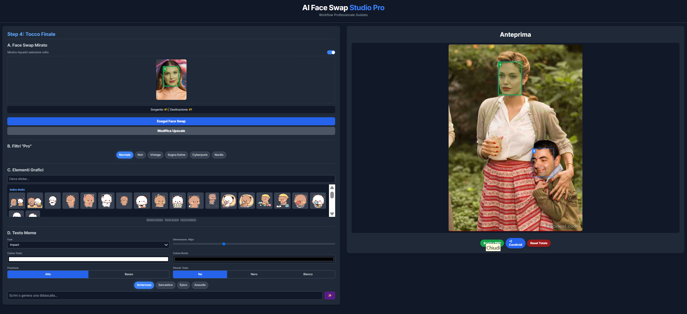
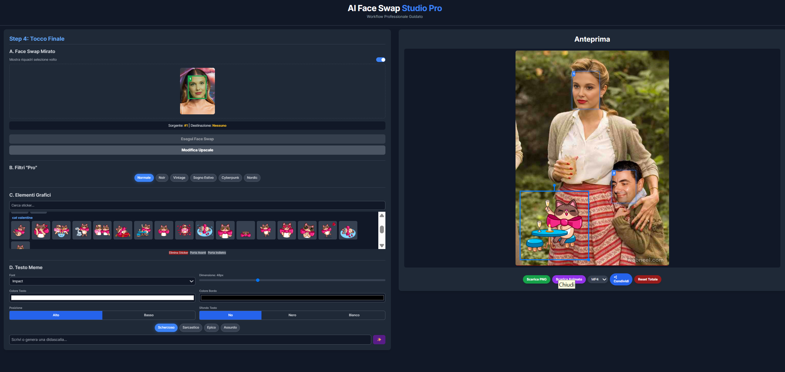

# 🎨 AI Face Swap Studio Pro 2.0

*A full-featured, step-by-step workflow for professional-grade image compositing— from face swap to AI-generated scenes and creative finishing.*

> **Why?**
> Most “face-swap” tools end at the swap.
> AFSS-Pro chains multiple state-of-the-art models so the **output of one stage becomes the input of the next**, producing a complete, photorealistic and share-ready result.

---

## 🚀 Key Features

| Category                      | Highlights                                                                                                                                                                                   |
| ----------------------------- | -------------------------------------------------------------------------------------------------------------------------------------------------------------------------------------------- |
| **Guided 4-Step Workflow**    | The frontend walks users through every stage— no GPU “gotchas”.                                                                                                                              |
| **Smart BG Removal**          | Automatic subject isolation via `rembg`.                                                                                                                                                     |
| **AI Scene Generation**       | Stable Diffusion XL (in-paint) turns text prompts into realistic backgrounds.                                                                                                                |
| **Prompt Enhancement**        | Google Gemini analyzes the subject and enriches the user’s prompt.                                                                                                                           |
| **Hi-Res Upscale & Detail**   | Real-ESRGAN + tiled ControlNet (Canny) restore sharpness without OOM.                                                                                                                        |
| **Targeted Face Swap**        | InsightFace with index-based source/target selection.                                                                                                                                        |
| **Face Restoration**          | GFPGAN for final skin & feature coherence.                                                                                                                                                   |
| **Creative Finishing Studio** | <ul><li>Text & meme controls (font, size, stroke, etc.)</li><li>Sticker gallery (PNG · WebM · Lottie/.tgs) with drag‑rotate‑resize</li><li>Export as PNG **or** animated MP4 / GIF</li></ul> |

---

## 🛠️ Tech Stack

| Layer         | Main Libraries / Tools                                                                           |
| ------------- | ------------------------------------------------------------------------------------------------ |
| **Backend**   | Python 3.9+, Flask, Waitress, `python-dotenv`, `imageio-ffmpeg`                                  |
| **AI Models** | PyTorch, Diffusers (SDXL + ControlNet), InsightFace, GFPGAN, Real‑ESRGAN, `rembg`, Google Gemini |
| **Frontend**  | HTML 5, Tailwind CSS, Vanilla ES 6 Modules, `<canvas>` API, `lottie-web`                         |

---

## 🧠 Architecture Overview

```
rembg  →  Gemini  →  SDXL  →  Real-ESRGAN  →  ControlNet  →  InsightFace  →  GFPGAN
(mask)    (prompt)   (scene)     (hi-res)      (detail)        (swap)        (restore)
```

* **Server‑side** heavy lifting (GPU); models kept hot in VRAM for < 1 s latency.
* **Client‑side** finishing (text, stickers, filters) via `<canvas>` keeps the server free of micro‑edits.
* **Animated export**: MediaRecorder captures the canvas → lightweight WebM → backend converts to MP4 / GIF with `ffmpeg`.

---

## ⚙️ Installation

```bash
git clone https://github.com/lelus78/FaceSwapApp.git
cd FaceSwapApp

python -m venv venv
# Windows
.\venv\Scripts\activate
# macOS / Linux
source venv/bin/activate

pip install -r requirements.txt
pip install imageio-ffmpeg   # server‑side ffmpeg wrapper
```

### Download Required Models

| Model                             | Path                    |
| --------------------------------- | ----------------------- |
| SDXL checkpoint (`*.safetensors`) | `./models/checkpoints/` |
| InsightFace `inswapper_128.onnx`  | `./models/`             |
| GFPGANv1.4 & RealESRGAN\_x2plus   | `./models/`             |

> Other models (ControlNet, InsightFace analysis, etc.) auto‑download on first run.

### Configure Environment

Create `.env` in the project root:

```bash
GEMINI_API_KEY="YOUR_GOOGLE_GEMINI_KEY"
```

### Run Locally

```bash
python run.py
```

Browse to [http://127.0.0.1:8765](http://127.0.0.1:8765).

### Core API Routes

| Route | Purpose |
| ----- | ------- |
| `/prepare_subject` | Remove the background using `rembg` and return a PNG |
| `/create_scene` | Compose a new scene around the subject with SDXL + ControlNet |
| `/detail_and_upscale` | Apply Real‑ESRGAN upscaling and ControlNet detailing |

---

## Image exemple




## 🔧 Contributing

1. Fork → feature branch → PR
2. Follow PEP‑8 & Prettier defaults
3. Include before/after screenshots for UI changes

### Roadmap

* [ ] Async task queue (Celery) for long AI jobs
* [ ] Vue/Svelte refactor for complex state
* [ ] Model hot‑swap UI (choose SDXL checkpoint, upscaler, etc.)
* [ ] Multi‑subject scenes
* [ ] Advanced sticker transforms (perspective / warp)

---

## 📜 License

MIT — do what you want, credit appreciated.
